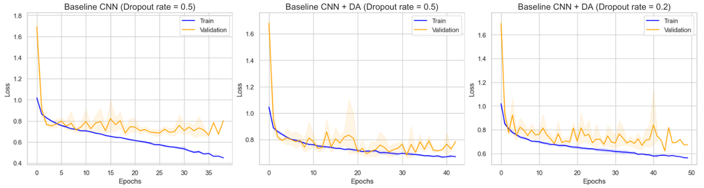
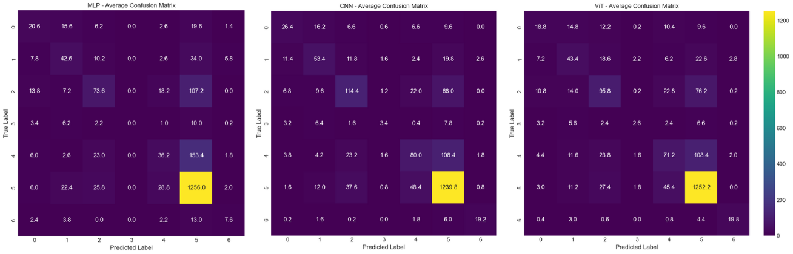
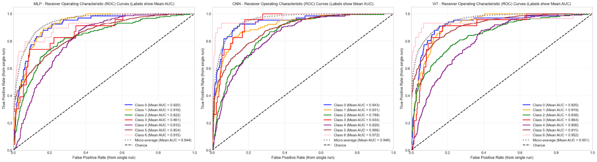

# Skin Lesion Classification with Deep Learning: MLP vs CNN vs Vision Transformer

[](https://www.python.org/)
[](https://pytorch.org/)
[](https://opensource.org/licenses/MIT)
[](https://medmnist.com/)

**Author:** José Matos ([Github](https://github.com/josemnmatos)) ([LinkedIn](https://linkedin.com/in/josemnmatos))

## Project Overview

This project implements and compares three deep learning architectures for automated classification of skin lesions from dermatoscopic images. It addresses a critical medical image analysis challenge: accurately identifying 7 types of skin lesions from the DermaMNIST dataset to assist in clinical diagnosis.

### Motivation and Application

Skin cancer is one of the most common forms of cancer worldwide, with early detection being crucial for successful treatment. Automated classification systems can serve as assistive tools for dermatologists, potentially improving diagnosis accuracy and efficiency.

### Technical Objectives

1. Implement and optimize models with different architectural paradigms
2. Create a robust, reproducible experimentation framework
3. Develop methods to handle intrinsic class imbalance through focused evaluation metrics
4. Demonstrate effective training techniques for small, low-resolution medical image datasets

**Technical Challenge:** Achieving competitive classification performance with low-resolution (28×28 pixel) medical images compared to benchmarks trained on higher-resolution data.

## Implemented Models & Architectural Design

Three distinct neural network paradigms were implemented and systematically compared:

### 1. Multi-Layer Perceptron (MLP)

- Custom implementation with configurable hidden layer sizes
- Flattened input representation (2,352 neurons - 28×28×3)
- Multiple ReLU-activated hidden layers with tunable parameters
- Parameter reset functionality for reproducible experiments

### 2. Custom Convolutional Neural Network (CNN)

- Two convolutional blocks with increasing feature maps (64 → 128)
- BatchNorm + ReLU activations for improved training dynamics
- MaxPooling for spatial dimension reduction
- Fully connected layers with dropout regularization (p=0.2)
- Optimized for the specific characteristics of DermaMNIST

### 3. Vision Transformer (ViT)

- Adapted for small image sizes with 4×4 patch size
- 8 transformer encoder layers with 8 attention heads
- Reduced embedding dimension (128) compared to standard ViT
- Optimized MLP dimension (1024) in transformer blocks
- Dropout regularization for improved generalization

## Technical Implementation

### Core Pipeline Architecture

The project implements a modular, reusable training framework through the `CustomModelPipeline` class, which provides a unified interface for model training, evaluation, and testing:

```python
class CustomModelPipeline:
    def __init__(self, model, criterion, optimizer_class, optimizer_params,
                 n_epochs, training_data, validation_data, test_data,
                 patience=10, min_delta=0.001, device="cpu"):
        # Initialize pipeline with configurable components
        ...
```

#### Implementation Highlights

1. **Model Agnostic Design**: Works with any PyTorch model that follows standard interface
2. **Early Stopping**: Automatically prevents overfitting with configurable patience
3. **Best Model Tracking**: Saves and restores best model state based on validation metrics
4. **Comprehensive Metrics**: Calculates per-class and aggregate performance (F1, AUC, Accuracy)
5. **Confusion Matrix Analysis**: Generates detailed confusion matrices for error analysis
6. **ROC Curve Generation**: Per-class and aggregate ROC curves with AUC calculation
7. **Execution Timing**: Records and reports training duration for efficiency comparison

### Data Processing & Augmentation

The pipeline incorporates data loading and preprocessing using MedMNIST's standardized framework with custom augmentation techniques:

```python
# Preprocessing with data augmentation
train_transform = transforms.Compose([
    transforms.ToTensor(),
    transforms.RandomHorizontalFlip(p=0.5),
    transforms.RandomVerticalFlip(p=0.5),
    transforms.RandomRotation(degrees=15)
])
```

The augmentation techniques were carefully selected to preserve diagnostic features while increasing training data variability to improve model generalization.

### Experimental Methodology & Validation Strategy

The project employs a rigorous statistical approach to ensure reliable conclusions:

1. **Multiple Runs**: Each experiment repeated 5 times (N_REPEATS=5)
2. **Confidence Intervals**: 95% CIs calculated for all metrics
3. **Class Imbalance Handling**: Macro-averaged F1 score as primary metric
4. **Micro & Macro Averages**: Both perspectives reported for comprehensive evaluation
5. **Visualization**: Loss curves, confusion matrices, and ROC curves for detailed analysis

## Results & Technical Analysis

### Comparative Model Performance

| Model   | Macro F1 (↑)      | Accuracy (↑)      | AUC Micro (↑)     |
| ------- | ----------------- | ----------------- | ----------------- |
| MLP     | 0.359 ± 0.046     | 0.717 ± 0.005     | 0.944 ± 0.002     |
| **CNN** | **0.531 ± 0.017** | **0.766 ± 0.007** | 0.948 ± 0.005     |
| ViT     | 0.480 ± 0.040     | 0.750 ± 0.005     | **0.951 ± 0.002** |

### Key Technical Findings

1. **CNN Architecture Advantage**: The custom CNN achieved the best balance of metrics relevant to clinical applications (F1 and Accuracy), demonstrating the effectiveness of specialized convolutional architectures for low-resolution medical imaging.

2. **ViT's Discriminative Power**: Vision Transformers showed strong discriminative ability (highest AUC) but were slightly less effective at handling the class imbalance (lower F1).

3. **Spatial Feature Learning**: The poor performance of MLPs confirms the importance of architectures that explicitly model spatial relationships in images.

4. **Scale-Efficient Performance**: All three implemented models surpassed the AUC (0.920) reported in the original MedMNIST v2 paper using ResNet-18 on 224×224 images, demonstrating efficient performance even with smaller model sizes.

## Training Dynamics & Performance Analysis

### Loss Convergence Analysis



The visualization demonstrates the effectiveness of the implemented early stopping mechanism, with clear convergence patterns and minimal overfitting across model types.

### Class-Specific Performance



The confusion matrix reveals stronger performance on certain classes like vascular lesions (vasc) and melanocytic nevi (nv), while showing challenges with rarer classes, highlighting the impact of class imbalance.

### Discriminative Ability



Model discrimination capabilities visualized through ROC curves, with AUC values consistently above 0.9, indicating excellent discriminative power across all implemented architectures.

## Project Architecture & Implementation Details

### Project Structure

```
ml-dermatology-project/
├── pipeline.py                   # Core training & evaluation framework
├── custom_models/                # Model implementations
│   ├── cnn.py                    # Custom CNN architecture
│   └── mlp.py                    # Custom MLP architecture
├── *_experiments.ipynb           # Experiment notebooks for each model type
├── helper_methods.py             # Data loading & visualization utilities
├── final_model_eval.ipynb        # Comprehensive model comparison
└── figures/                      # Generated visualizations
```

### Technical Stack & Dependencies

- **Deep Learning Framework**: PyTorch 1.9+
- **Dataset**: MedMNIST 2.0+
- **Evaluation**: scikit-learn 1.0+
- **Transformer Implementation**: vit-pytorch
- **Data Analysis**: NumPy, Pandas
- **Visualization**: Matplotlib, Seaborn
- **Statistical Analysis**: SciPy

## Deployment & Usage Instructions

### Environment Setup

```bash
git clone https://github.com/josemnmatos/ml-dermatology-project.git
cd ml-dermatology-project
pip install -r requirements.txt
```

### Running the Experiments

1. **Model-Specific Experiments**:

   - CNN experiments: `jupyter notebook cnn_experiments.ipynb`
   - MLP experiments: `jupyter notebook mlp_experiments.ipynb`
   - ViT experiments: `jupyter notebook vit_experiments.ipynb`

2. **Comprehensive Evaluation**:
   - Run: `jupyter notebook final_model_eval.ipynb`

### Integration Capabilities

The modular design of the CustomModelPipeline allows for easy extension to:

- New model architectures
- Different medical image datasets
- Various optimization strategies
- Custom evaluation metrics

## Future Research Directions

Based on the findings of this project, several promising technical extensions are identified:

1. **Resolution Enhancement**: Implement super-resolution techniques to improve diagnostic quality of low-resolution images
2. **Transfer Learning**: Leverage pre-trained models on larger dermatology datasets to improve feature extraction
3. **Ensemble Methods**: Combine predictions from multiple architectural paradigms to boost overall performance
4. **Explainability**: Implement visualization of attention maps (for ViT) and feature importance to improve clinical interpretability
5. **Clinical Validation**: Partner with dermatologists for expert validation of model predictions in realistic settings

## Key Project Contributions

1. Creation of a unified experimentation framework for fair comparison of neural architectures
2. Demonstration that specialized CNNs remain competitive with Transformers for low-resolution medical imaging
3. Achievement of state-of-the-art results on the DermaMNIST dataset
4. Development of efficient model implementations suitable for deployment in resource-constrained environments
5. Comprehensive comparison methodology addressing both classification accuracy and clinical relevance

## References

1. Yang, J., et al. (2023). MedMNIST v2 — A large-scale benchmark for 2D and 3D biomedical image classification. _Medical Image Analysis_, 75.
2. Tschandl, P., et al. (2018). The HAM10000 dataset, a large collection of multi-source dermatoscopic images of common pigmented skin lesions. _Scientific Data_, 5(1).
3. Dosovitskiy, A., et al. (2020). An Image is Worth 16x16 Words: Transformers for Image Recognition at Scale. _International Conference on Learning Representations_.
4. Lin, T. Y., et al. (2017). Focal loss for dense object detection. _IEEE Transactions on Pattern Analysis and Machine Intelligence_, 42(2).
5. He, K., et al. (2016). Deep residual learning for image recognition. _IEEE Conference on Computer Vision and Pattern Recognition_.

---

**For complete implementation details, hyperparameter tuning processes, and extended analysis, please refer to the [comprehensive project report](https://github.com/josemnmatos/ml-dermatology-project/blob/main/report.pdf).**
